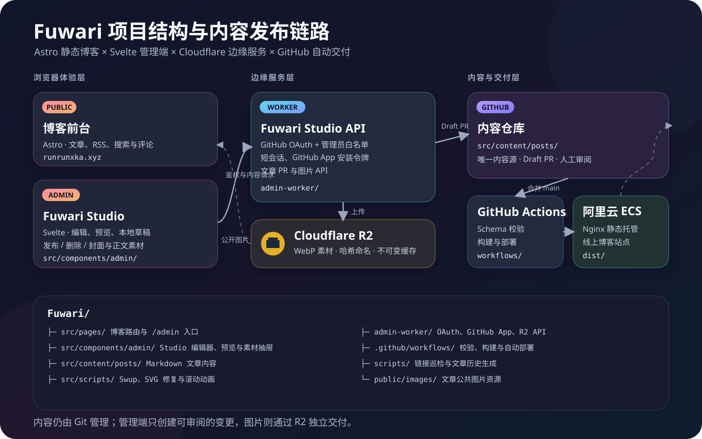

# RunRunxka's Blog

这是我的个人技术博客，主要记录开发实践、工具折腾和一些值得回头复盘的问题。站点从 [Fuwari](https://github.com/saicaca/fuwari) 开始，后来根据自己的写作习惯和部署方式逐步改成了现在的样子。

博客地址：[runrunxka.xyz](https://runrunxka.xyz)

## 页面预览

页面截图统一放在 `docs/images/`。下面的文件名先固定下来，之后只要把对应图片替换进去，再取消下方引用的注释即可显示新的截图。

| 页面 | 图片文件 |
| --- | --- |
| 首页 | `docs/images/home.png` |
| 文章页 | `docs/images/post.png` |
| Fuwari Studio | `docs/images/studio.png` |
| 封面生成器 | `docs/images/cover.png` |

<!-- 把截图放入 docs/images/ 后，取消下面引用的注释即可：


 -->

项目结构图：



## 现在能做什么

- 用 Markdown 写文章，frontmatter 负责标题、发布时间、描述、封面、标签、语言、草稿和置顶状态等信息。
- 首页支持按时间、标题排序，归档页按年份整理文章，生产环境会自动隐藏草稿。
- 文章页提供目录、阅读时间、字数、上一篇/下一篇导航、代码高亮、数学公式和图片放大查看。
- 内置全文搜索、RSS、Sitemap、SEO 元数据和 Giscus 评论。
- 支持暗色、浅色和跟随系统三种主题模式，也可以调整主题色并开启彩虹模式。
- `/cover/` 提供一个简单的文章封面生成器，`/tools/` 是工具入口页。
- `/friends/` 和 `/sponsors/` 用于展示友链与赞助信息，并配有对应的自动校验流程。
- 站点接入 Umami 统计，导航中还保留了 OpenList 云盘入口。
- `/admin/` 是 Fuwari Studio，可以编辑文章、预览内容、管理封面和正文图片，并创建发布用的草稿 PR。

## 技术栈

| 位置 | 使用的技术 |
| --- | --- |
| 页面框架 | Astro 5.7、TypeScript |
| 交互组件 | Svelte、GSAP、Swup |
| 样式 | Tailwind CSS、Stylus |
| Markdown | Remark、Rehype、Expressive Code、KaTeX |
| 评论与统计 | Giscus、Umami |
| 管理端 API | Cloudflare Workers、GitHub OAuth、GitHub App、Cloudflare R2 |
| 发布 | GitHub Actions、pnpm、rsync |

## 本地运行

项目使用 pnpm，仓库锁定的版本为 `pnpm@9.14.4`。准备好 Node.js 后执行：

```bash
pnpm install
pnpm dev
```

开发服务器启动后，按终端提示打开本地地址。常用命令如下：

```bash
# 生产构建
pnpm build

# 预览构建结果
pnpm preview

# TypeScript 检查
pnpm type-check

# 格式化 src
pnpm format

# 检查并修复 src 的规范问题
pnpm lint
```

仓库目前没有单独的测试脚本，日常验证以 `pnpm build` 和 `pnpm type-check` 为主。

## 写文章

### 直接在仓库里写

先创建文章文件：

```bash
pnpm new-post my-post
```

脚本会在 `src/content/posts/` 下生成 Markdown 文件。文章的 frontmatter 需要符合 `src/content/config.ts` 中的 schema，最基本的写法如下：

```md
---
title: 我的文章
published: 2026-08-02
description: 文章摘要
image: ./cover.webp
tags:
  - Astro
  - TypeScript
lang: zh-cn
draft: false
---

正文从这里开始。
```

文章图片可以和文章放在内容目录中，也可以使用站点能够访问到的图片地址。修改完成后，按项目约定提交：

```bash
git add src/content/posts/my-post.md
git commit -m "posts:发布新文章《我的文章》。"
git push origin main
```

发布文章时，提交信息使用下面的格式：

```text
posts:发布新文章《文章标题》。补充说明。
```

### 使用 Fuwari Studio

打开 `/admin/` 后，可以在浏览器中编辑文章、查看预览、上传封面和正文图片。Studio 不会把 GitHub PAT 或 App 私钥放进浏览器，而是通过 GitHub OAuth 确认身份，再由独立的 Cloudflare Worker 使用 GitHub App 创建分支和草稿 PR。

文章 PR 需要在 GitHub 上检查并手动合并；合并到 `main` 后，`Build & Deploy` workflow 才会继续构建和部署。管理端 Worker 的创建、密钥、R2 和部署步骤见 [`admin-worker/README.md`](admin-worker/README.md)。

## 发布流程

主分支的发布流程由 `.github/workflows/deploy.yml` 负责：

```text
提交或合并到 main
        ↓
GitHub Actions
  安装依赖、更新文章历史、pnpm build
        ↓
rsync dist/
        ↓
服务器上的博客目录
```

文章 PR 会先经过 `.github/workflows/validate-post-pr.yml` 的构建检查。这个检查只负责确认文章改动可以正常构建，不会替你合并 PR。

## 目录结构

```text
.
├── src/
│   ├── components/        # Astro 与 Svelte 组件
│   ├── content/
│   │   ├── posts/          # Markdown 文章
│   │   ├── assets/         # 内容相关图片
│   │   └── config.ts       # 内容集合与 frontmatter schema
│   ├── layouts/            # 页面布局
│   ├── pages/              # 页面和路由
│   ├── plugins/            # Remark / Rehype 插件
│   ├── styles/             # 全局样式、文章样式和 Stylus 变量
│   └── config.ts           # 站点、导航、个人信息和第三方服务配置
├── admin-worker/           # Fuwari Studio 的 Cloudflare Worker
├── scripts/                # 新建文章、文章历史、图片和内容维护脚本
├── public/                 # 静态资源
├── docs/images/            # README 页面截图
└── .github/workflows/      # 构建、部署和 PR 校验
```

几个常改的位置：

- 站点标题、导航、主题色和第三方服务：`src/config.ts`
- 文章字段定义：`src/content/config.ts`
- 首页分页、排序和草稿过滤：`src/utils/content-utils.ts`、`src/pages/[...page].astro`
- 文章详情页：`src/pages/posts/[...slug].astro`
- 管理端页面：`src/pages/admin/index.astro` 和 `src/components/admin/`

## 修改主题

主题色的默认色相在 `src/config.ts` 的 `themeColor.hue` 中设置。颜色、浅色模式和文章渲染相关样式主要位于 `src/styles/`。

项目里的 Svelte 组件仍以传统语法为主，新增组件时请沿用现有写法，并在修改后至少运行一次构建。涉及内容 schema、文章脚本或管理端 API 时，最好同时检查对应的工作流和部署配置。

## 致谢与许可

本站的基础主题来自 [Fuwari](https://github.com/saicaca/fuwari)，在此基础上进行了页面、内容系统、工具和发布流程的定制。

项目内容与代码按 [CC BY-NC-SA 4.0](https://creativecommons.org/licenses/by-nc-sa/4.0/) 许可发布；如果要转载文章或复用内容，请保留署名并遵守非商业使用与相同方式共享条款。
