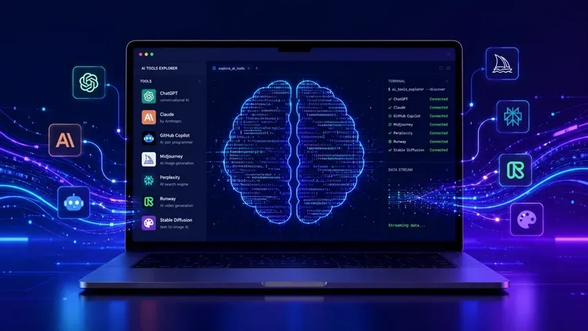

2025 年，AI 编程工具遍地开花：Cursor、Trae、Claude Code、Codex……名字越来越响，宣传越来越猛。

但我和大多数人一样——不是 AI 研究员，不是算法工程师，就是一个**想偷点懒的普通学生**。

这篇文章不排榜单，不测评参数。它讲的是一段真实的演进路径：

> GUI 按钮 → API 调用 → 终端 Agent → 个人自动化系统

每个转折都有原因，每个选择都有代价。希望能帮你少走弯路。

---

## Phase 1：GUI 时代 —— Cursor 与 Trae

### 起点：数学建模竞赛

大二那年参加数模竞赛，身边同学都在讨论 AI 写代码，我也入了 Cursor 的坑。新账号有免费额度但不够用，于是我上 GitHub 找了个叫 `ycursor` 的开源项目，能自动注册新账号。

回头看，从第一天起我的原则就很朴素：

> 能用免费的不用付费的，能自动化的不手动操作。

### 培训期：体验尚可

学校培训期间，Cursor 确实比在网页上复制粘贴方便——它有项目上下文，不用每次都重新解释。就像一个随时在线的编程搭子。

### 比赛期：问题暴露

真正比赛时，两个问题让我头疼：

1. **不理解实际任务。** 数模题有隐藏约束，Cursor 方向对但细节偏，你得自己懂代码才能纠错。
2. **改代码是「整段扔给你」。** 不改哪里、为什么改一概不说，新手想优化无从下手。

> 能帮你入门，但不能指望它替你思考。

### 转战 Trae

比赛后试了 VSCode + GitHub Copilot，体验不错但额度用完了。学生党续不起，于是找到了 Trae——能调免费国产模型，效果不如 Claude 3.7，但胜在不花钱。

然而好景不长。用的人一多，免费模型排队越来越长。有时等几分钟才出结果，大脑上下文刚热起来，结果还在转圈。

这件事让我想明白了一个道理：

> 免费是有代价的——要么是能力上限，要么是等待成本。当这个代价大到影响工作流，就该找下一方案了。

---

## Phase 2：转折 —— DeepSeek V4 与 API 调用

### 两件事推了我一把

1. Trae 排队排到怀疑人生，非常打断思路。
2. 电子设计竞赛的**无人机项目**——代码、硬件、通信全耦合，需要工具理解整个工程，而 GUI 工具每次对话基本孤立。

恰好 DeepSeek V4 发布，价格便宜还打折。于是决定：与其等队列，不如自己调 API。

### 调 API 没那么吓人

去 DeepSeek 官网充值、拿 Key，用现成脚本就能调通，比想象中轻松太多。

然后上 GitHub 找了个叫 `ccswitch` 的工具，专门给 Claude Code 切换底层模型。按 README 走一遍就配好了。

小坑：`ccswitch` 不能在 Claude Code 内直接切模型，得退出重配，且每个模型配置独立、互不继承。但如果只用一个模型（比如我主要用 DeepSeek V4），这个问题基本不存在。

### 五一的实际搭建

五一假期，我没装 Claude Code 桌面版，而是直接用了 **CLI 版 + VSCode 插件**。好处是可以搭配 Git——改坏了随时回滚，版本管理很安心。

### 成本：学生党的惊喜

DeepSeek API 本身便宜，Claude Code 缓存命中率又在 90% 以上（重复上下文不计费），结果**2 亿 token 才花了 20 块左右**。

2 亿 token 什么概念？正常人几个月用不完。对比 Cursor 每月几十美金，性价比碾压。

### 薅羊毛小贴士

小米 MiMo 有个免费 Token 激励计划：`100t.xiaomimimo.com`，申请就给 2 亿 credits。MiMo V2.5 系列支持接 Claude Code、Cursor 直接用。活动限时到 5 月底，申请表填得越详细额度越高。

> 反正不要钱，多个备选不亏。

---

## Phase 3：Agent 时代 —— 终端工具大乱斗

研究 API 时顺藤摸瓜，发现了 Claude Code、Codex 这些终端 Agent。第一反应：

> 原来 AI 不只是聊天窗口，还能在终端里直接帮你干活。

### Windows：Claude Code 是主力

Claude Code 在编程上的优势很突出：

- **全局理解。** 不只看单个文件，而是理解整体结构、依赖关系、模块调用。工程项目的刚需。
- **插件生态。** MCP、Skill 插件省 token，还有成套提示词模板。Trae / Cursor 时代完全没这体验。

### Mac：实验田

Mac 是类 Linux 系统，CLI 兼容性好，心态也更轻松——主要是探索和娱乐。

- **Codex**：有免费额度但不支持国产模型，我就用它做自动化：每天自动采集 GitHub 热门项目，整理成文档。第一次看它自己打开网页、读数据、生成文档，说实话有点震撼。
- **OpenCode**：自带免费模型，日常搜新闻、查资料、对比不同模型的回答风格。反正不要钱。

### 平台对比

| 维度 | Windows | Mac |
| --- | --- | --- |
| 主力工具 | Claude Code | Codex + OpenCode |
| 主要用途 | 编程、项目管理 | 自动化任务、娱乐探索 |
| 模型来源 | DeepSeek V4 API | 免费额度 + 内置模型 |
| 定位 | 生产工具 | 实验田 / 玩具 |

Mac 的 CLI 体验确实更丝滑。重度终端用户如果只能选一台，Mac 更省心。

---

## Phase 4：生态整合 —— WorkBuddy + Obsidian + Git

### 发现 WorkBuddy

每天都在刷 AI 工具，看到了 WorkBuddy 和 QC Law，都是腾讯出品：

- **WorkBuddy**：终端 Agent，类似 Codex
- **QC Law**：手机端与电脑端协作

### 为什么从 Codex 迁移

1. **免费额度高。** 自带额度每月刷新，国产模型全接入。选混元 3 或 DeepSeek V4 Flash 这种打折模型，能用非常久。
2. **自动化更顺手。** 定时任务、自动化流程比 Codex 方便很多。
3. **腾讯生态联动。** 这是最大的差异化优势。

### 腾讯生态的真香时刻

WorkBuddy 和 QC Law 同为腾讯开发，打通了 QQ、微信、腾讯文档：

**手机远程操控电脑**

在微信上给 WorkBuddy 发指令，它就在电脑上执行。走在路上想查资料或启动采集任务，掏出手机发条微信就行。不用 SSH，不用任何技术操作。

**腾讯文档当云数据库**

腾讯文档有云存储，WorkBuddy 能直接读写。采集的信息同步进去，查询、筛选、整理都很方便。Codex / OpenCode 时代是「数据孤岛」，得自己解决存储和跨设备问题，而 WorkBuddy 天生打通了。

### 每日自动化信息流

**第一步：采集**

WorkBuddy 每天自动获取 GitHub 热门、AI 动态、时政新闻等我关注的内容。

**第二步：总结 → Obsidian**

Agent 整理总结后写入 Obsidian。选它是因为纯本地 Markdown，不被任何格式锁死，接 Agent 也很方便。

**第三步：Git 同步**

Obsidian 笔记就是 Markdown 文件，`git push` 到私有仓库即实现跨设备同步。

**关键：Mac 当 24 小时服务器**

```text
采集 → 总结 → 写入 Obsidian → Git 上传
全程无人干预，成本几乎为零。

### 方案对比

| 维度 | 之前：Codex / OpenCode | 现在：WorkBuddy |
| --- | --- | --- |
| 自动化 | 手动触发或自己写脚本 | 内置自动化，设一次不管 |
| 数据存储 | 散落各处 | Obsidian + Git 统一管理 |
| 模型成本 | API 少量费用 + 免费额度 | 基本全靠免费额度 |
| 跨设备 | 不方便 | Git 私有仓库随时同步 |
| 腾讯生态 | 无 | 微信 / QQ 远程 + 腾讯文档 |
| 待机执行 | 不稳定 | Mac 挂着就能跑 |

---

## Phase 5：探索中 —— Hermes 与未来

OpenClaw 之后出了 Hermes，纯粹好奇试试。

### 优点

集成度很高的 CLI 工具，交互流畅。编程时缓存命中率似乎比 Claude Code 还高一截，在意 token 成本的人会喜欢。

### 硬伤

1. **必须 Linux。** Windows 上只能走 WSL，多一层中转效率打折：编程不如 Claude Code，联网搜索 token 消耗也大。
2. **生态未成熟。** 自动化任务配置远不如 Codex / WorkBuddy 方便，需要自己折腾，新手不友好。

### 定位

现阶段 Hermes 更像**有潜力的实验品**。方向对、集成度高，但要替代现有工作流还需要时间。等它原生支持 Windows / Mac 且自动化做好后，再认真考虑迁移。

---

## 总结与展望

一个月，从 GUI 按钮到终端命令，从白嫖额度到搭建 24 小时自动化系统，从 Windows 到 Mac 再到 WSL……

踩的坑比走的路多，但每个坑都让自己更清楚想要什么。

### 给想用 Agent 编程的你

> 别在 GUI 工具上耗太久。

Cursor、Trae 入门友好，但当你开始等队列、改不动代码时，就该往前走了。

下一步：API + 终端 Agent。

我的路线是 `DeepSeek V4 → Claude Code CLI → VSCode 插件`。走通之后，最直观的感受：**项目理解力上了一个台阶**。它不再是孤立的一段代码，而是能看到整个工程上下文。

成本也远比你想象的友好——2 亿 token 20 块，学生党完全负担得起。

再往后，WorkBuddy + Obsidian + Git 这套组合能让编程效率和信息管理效率同时提升，但不急，基础先打好。

### 给对 AI 感兴趣但编程需求不高的你

你可能不需要 AI 写代码，但需要它帮你：

- 每天自动收集感兴趣的信息
- 把零散内容整理成有条理的笔记
- 当随时在线的问答搭子

这些东西省的不是钱，是**注意力**。

我现在 Mac 挂着 WorkBuddy 24 小时跑，微信上就能发指令。走在外面突然想到什么，掏出手机发条消息，回家时结果已经准备好了。

> 这种体验，一旦用过就回不去了。

它不是帮你做什么大事，而是把那些琐碎、重复、每天消耗你的事情交给 Agent。省下来的时间和注意力，才能用在真正重要的事上。

---

## 最后

这篇文章不是「你应该用什么工具」，而是一个普通学生怎么一步步摸索出属于自己的路。

AI 工具变化很快，今天最好的明天可能就被超越。但有件事不会过时：

> 搞清楚自己需要什么，然后找到满足那个需求的最低成本方案。

不需要追最新最酷的工具，也不需要一步到位。从能上手的地方开始，不舒服了就换，换着换着就找到自己的路了。

如果你也在折腾 AI 工具，欢迎交流——这个东西发展太快，一个人摸索还是太慢了。